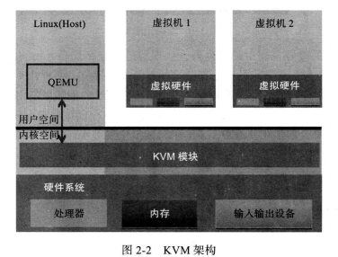
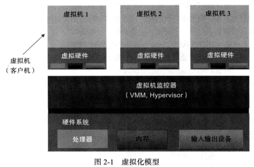

# 第一章

## 基础知识
* 在 X86 平台虚拟化技术中，新引入的虚拟化层通常称为虚拟机监控器（Virtual Machine Monitor, VMM），也叫做 Hypervisor。
  虚拟机监控器运行的环境，也就是真实的物理平台，称之为宿主机。
  而虚拟出来的平台通常称为客户机，里面运行的系统对应地也称为客户机操作系统。

* KVM（kernel Virtual Machine）
  * 架构
    
  * 功能：
    1. 内存管理：KVM 支持最新的基于硬件的内存虚拟化功能。
       * 基础知识：
         1. 物理内存，顾名思义，就是实实在在存在的那个东西，插在你电脑主板上的内存条所提供的空间。
         2. 页面文件，这个是硬盘上的一块空间，在Windows下表现为一个文件。这个页面文件存在的意义就是在物理内存被占用满以后，将物理内存中的东西移动到硬盘上的这个空间，腾出物理内存给需要的应用程序来使用。
         3. 交换区，这个是物理内存和页面文件空间的总和，“交换”的含义，则是指在硬盘文件、CPU和其它IO之间进行数据的传递和暂存（这句话对于了解计算机运行基本流程的人来说应该可以理解）。
       * KSM（Kernel Same-page Merging，KSM）是一个内核功能。KSM 扫描每个虚拟机内存，如果虚拟机拥有相同到内存页面，KSM 将这些页面合并到一个可以在虚拟机之间共享的页面，且只存储一个副本。如果一个客户机尝试更改这个共享页面，它将得到自己到专用副本。

    2. 存储
       * KVM 原生磁盘格式：QCOW2
       * 磁盘镜像支持按需分配，仅在虚拟机需要时分配存储空间，而不是提前分配整个存储空间，提高存储利用率。 

    3. 设备驱动程序

    4. 性能和可伸缩性

  * 虚拟化模型
    
    1. 最底层是整个物理系统，也就是平常看得见摸的着的系统硬件（CPU， 内存， 输入输出设备）。
    2. 中间层运行的是虚拟机监控器（VMM 或 Hypervisor）。监控器的主要职能：管理真实的物理硬件平台，并为每个虚拟客户机提供相应的虚拟硬件平台。
    3. 最上层是 3 个虚拟机的实例，每个虚拟机看起来就像是一个小的但是完整的计算机系统，具有自己的“系统硬件”，包括自己的处理器、内存和输入输出设备。在计算机系统上运行着虚拟机自己的 OS（linux or windows）。并且 KVM 还支持嵌套虚拟化哦。

* KVM 模块
  * KVM 模块是 KVM 虚拟机的核心部分。
  * KVM 仅支持硬件虚拟化。
  * 功能
    1. 初始化 CPU 硬件。
    2. 打开虚拟化模式。
    3. 将虚拟客户机运行在虚拟机模式下。
    4. 对虚拟客户机的运行提供一定的支持。

  * 举个例子：KVM 在 Intel 公司的 CPU 上运行
    1. 内核被加载时，KVM 会先初始化内部的数据结构。
    2. 准备好后，KVM 模块检测系统当前的 CPU，然后打开 CPU 控制寄存器 CR4 中的虚拟机模式开关，并通过执行 VMXON 指令将宿主操作系统（包括 KVM 模块本身）置于虚拟化模式中的根模式中。
    3. KVM 模块创建特殊设备文件 `/dev/kvm` 并等待来自用户空间的命令。
    4. 接下来虚拟机的创建和运行将是一个用户空间的应用程序（QEMU）和 KVM 模块相互配合的过程了。

* QEMU 设备模型
  * QEMU 自身就是一个著名的开源虚拟化软件，且是一个纯软件实现的，性能较低下。
  * QEMU 的代码中有整套的虚拟机实现，包括处理器虚拟化、内存虚拟化、以及 KVM 使用到的虚拟设备模拟（例如：网卡，显卡，存储控制器和硬盘等）。
  * 为了简化开发和代码重用，KVM 在 QEMU 的基础上进行了修改。
    1. 虚拟机运行期间，QEMU 会通过 KVM 模块提供的系统调用进入内核，由 KVM 模块负责将虚拟机置于处理器的特殊模式运行。
    2. 遇到虚拟机进行输入输出操作，KVM 模块会从上次的系统调用出口处返回 QEMU，由 QEMU 来负责解析和模拟这些设备。
  * 从 QEMU 的角度出发，可以说 QEMU 使用了 KVM 模块的虚拟化功能，为自己的虚拟机提供硬件虚拟化的加速，从而极大地提高了虚拟机的性能。
  * QEMU 还做了哪些事情？
    1. 虚拟机的配置和创建。
    2. 虚拟机运行依赖的虚拟设备。
    3. 虚拟机运行时的用户操作环境和交互。？？？？？？？？？
    4. 一些准对虚拟机的特殊技术（Eg：动态迁移）。
